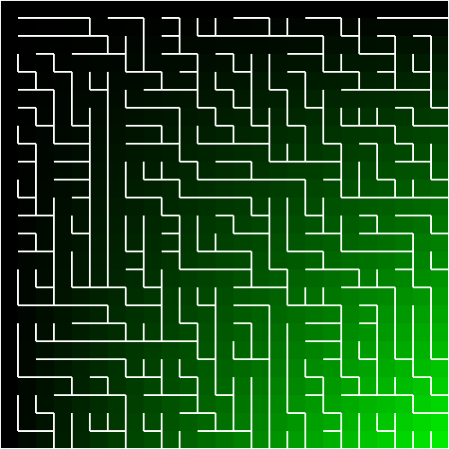

# Mazes for Programmers in Haskell

## Notes

The story thus far&hellip;

* Implemented simple ASCII art rendering of grids
* Implemented simple PNG rendering of gris
* Implemented binary tree algorithm for generating mazes

## Example



## Set up dev environment

```bash
stack build intero
stack build --copy-compiler-tool ghcid
```

## Build

```bash
stack build
```

## ghcid

```bash
stack exec ghcid -- -T':main'
```

## Licence

[MIT License][licence]

[licence]: LICENSE
